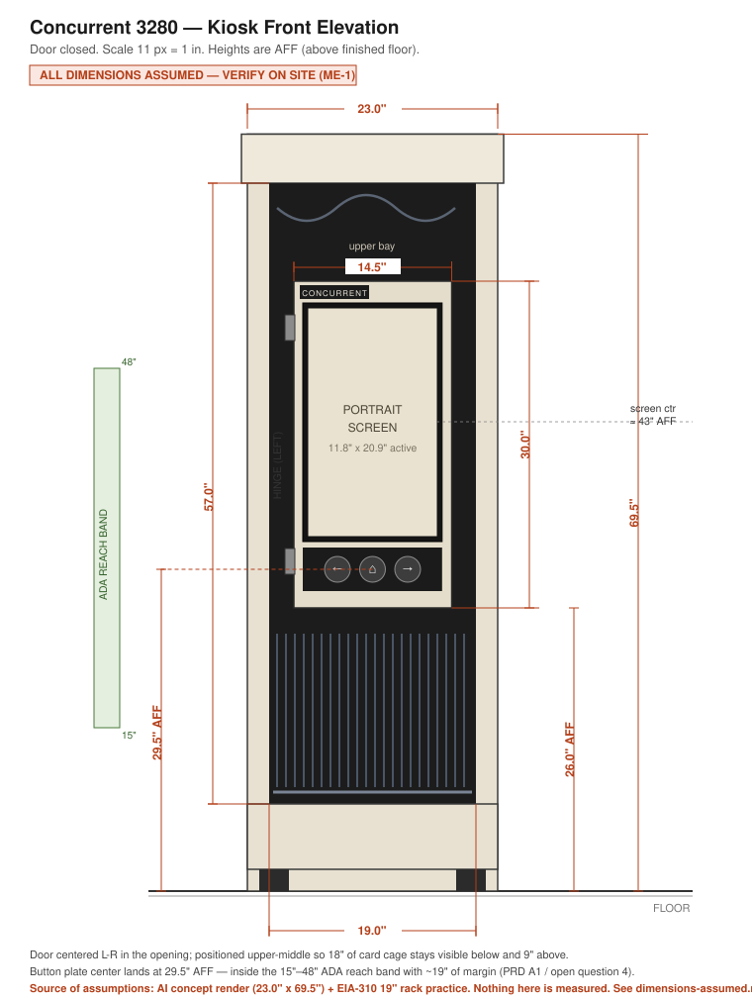

# Assumed Dimensions — v0 (pre-measurement)

> **Status: CONCEPT / ASSUMED.** Nothing on this page has been measured. Every
> number is derived from the AI concept render plus standard 19″ rack practice,
> published so the design can be discussed, shopped for, and sanity-checked
> *before* the site visit. **ME-1 replaces this file with measured reality.**
> Do not cut material against these numbers.

**Reads with:** [`measurement-checklist.md`](measurement-checklist.md) ·
[`../docs/01-prd.md`](../docs/01-prd.md) §9 (MR1–MR19) ·
[`../docs/02-architecture.md`](../docs/02-architecture.md) §8

---

## 1. Where these numbers come from

| Source | Confidence | What it gives us |
|---|---|---|
| AI concept render (`kiosk-concept.jpg`) | **Low** — art, not a drawing | Cabinet 23.0″ W × 69.5″ H; door proportions; left hinge |
| EIA-310 19″ rack standard | **High** — if the 3280 is a 19″ rack | Rail spacing 17.75″ clear, hole centers 18.312″, 1U = 1.75″ |
| 24″ 16:9 panel geometry | **High** — arithmetic | Active area 20.92″ × 11.77″ → portrait 11.8″ W × 20.9″ H |
| Component depths (Pi 4, LCD, arcade buttons) | **Medium** — datasheet typicals | 2.5″ door depth budget |

The render's own two callouts (23.0″ × 69.5″) are the only "dimensions" we have,
and the render is not orthographic — its horizontal and vertical scales disagree
by ~40%. **Treat 23.0 × 69.5 as a claim to verify, not a measurement.**

---

## 2. Drawings

| | Drawing | What it settles |
|---|---|---|
| 01 | [Cabinet front elevation](drawings/01-cabinet-front-elevation.svg) | Door size and where it sits; ADA button height |
| 02 | [Door front layout](drawings/02-door-assembly.svg) | Every face dimension of the door; weight budget |
| 03 | [Plan section — swing & clearance](drawings/03-plan-section-clearance.svg) | Depth budget; **the C1 clearance risk**; swing envelope |
| 04 | [Reversible mount candidates](drawings/04-mount-candidates.svg) | Three no-drill options and what to check for each |

---

## 3. The assumed dimension set

### Cabinet

| Ref | Dimension | Assumed | Basis |
|---|---|---|---|
| A1 | Overall width | **23.0″** | Render callout |
| A2 | Overall height incl. feet | **69.5″** | Render callout |
| A3 | Overall depth | **26″–36″** | Typical 19″ rack cabinet — **wide open, must measure** |
| A4 | Top cap height | 4.5″ | Proportion estimate |
| A5 | Plinth + feet height | 8.0″ | Proportion estimate |
| A6 | Front opening, clear width | **19.0″** | 23.0″ less ~2.0″ frame each side |
| A7 | Front opening, clear height | **57.0″** | 69.5 − 4.5 (cap) − 8.0 (plinth/feet) |
| A8 | Opening bottom, AFF | **8.0″** | = A5 |
| A9 | Opening top, AFF | **65.0″** | = A8 + A7 |

### Display (24″ target — MR12)

| Ref | Dimension | Assumed |
|---|---|---|
| D1 | Panel class | 24″ 16:9, run portrait |
| D2 | Active area | **11.77″ W × 20.92″ H** (1080 × 1920) |
| D3 | Panel outline (glass + backlight frame) | ~12.4″ × 21.6″ — **measure the real panel** |
| D4 | Panel thickness, de-cased | ~0.6″ (edge-lit LED) |

*27″ stretch option:* active 13.24″ × 23.53″, door grows to ~15.9″ × 32.7″.
Only viable if the measured clear opening is **≥ 21″**. At 19″ it leaves 1.5″ of
viewing window each side, which loses the concept's "window around the screen".

### Door

| Ref | Dimension | Assumed | Note |
|---|---|---|---|
| B1 | Door overall | **14.5″ W × 30.0″ H** | Derived from D2 outward |
| B2 | Black bezel block | 12.8″ × 21.9″ | 0.5″ reveal around active |
| B3 | Tan face margin, sides | 0.85″ each | |
| B4 | Badge band (top) | 2.0″ | "CONCURRENT" |
| B5 | Reveal below screen | 0.6″ | |
| B6 | Button plate | 12.8″ W × 4.0″ H | 3 buttons @ 3.2″ c-c + 2 spare blanks |
| B7 | Bottom rail | 1.5″ | |
| B8 | **Door depth, bezel face → rear shroud** | **≤ 2.5″** (stretch 2.0″) | See §5 |
| B9 | Door weight | ~12 lb | ~85 in-lb moment at the hinge |

### Placement

| Ref | Dimension | Assumed | Why |
|---|---|---|---|
| P1 | Door bottom, AFF | **26.0″** | Upper-middle per ME-3 |
| P2 | Door top, AFF | 56.0″ | = P1 + B1 |
| P3 | **Button plate center, AFF** | **29.5″** | |
| P4 | Screen active center, AFF | ~43″ | Comfortable standing/seated compromise |
| P5 | Viewing window below door | 18.0″ | Card cage stays visible — the good part |
| P6 | Viewing window above door | 9.0″ | |

---

## 4. What this already resolves

**PRD open question 4 — "does the door-mounted button plate meet ADA reach, or do
we need a separate low plate?"**

Under these assumptions: **yes, comfortably, and no low plate is needed.**

The door can sit anywhere from `door bottom = 21.5″ AFF` (vertically centered in
the opening) to `35.0″ AFF` (flush with the opening top) and still put the button
plate center between **25.0″ and 38.5″ AFF** — the whole range fits inside the
15″–48″ ADA reach band with ≥ 9″ of margin at either end. At the recommended
26.0″ door bottom the buttons land at 29.5″ AFF, near the middle of the band.

This holds as long as A5 (plinth + feet ≈ 8″) and B1 (door ≈ 30″ tall) survive
measurement. If the real plinth is much taller, re-check. **Confirm A5 and A8 on
site and this question closes.**

---

## 5. Depth budget — and the one number that can break the design

| Layer | Depth |
|---|---|
| Bezel face + black bezel | 0.25″ |
| Bare LCD panel | 0.60″ |
| Standoff / air gap | 0.40″ |
| Controller board + Pi 4 | 1.00″ |
| Vented rear shroud | 0.25″ |
| **Total** | **2.50″** |

**Buttons, not the panel, set the floor.** A 30 mm arcade body needs ~1.4″ behind
the plate; 24 mm bodies need ~1.1″. Both fit inside 2.5″ — but if depth gets
tight, downsizing the buttons is the cheapest 0.3″ available.

### C1 — the critical measurement

**C1 = distance from the cabinet's front face plane to the frontmost object
inside the opening** (board edge, connector, ribbon cable, card-puller handle).

**Rule: C1 ≥ door depth + 0.5″.** Assumed here: C1 = 3.0″.

If C1 measures under 3.0″, the door has to change. Escalation ladder, cheapest
first:

1. **24 mm buttons** instead of 30 mm — buys ~0.3″.
2. **Move the Pi off the door**, run a ribbon/HDMI over the hinge — buys ~0.5″,
   but breaks A7.2 (power-only across the hinge) and MR18. Costs reliability.
3. **Stand the door proud** of the front face on the frame — the door no longer
   sits near-flush, which weakens MR19 but is otherwise harmless.
4. **Recess the frame between the boards** rather than over them — only possible
   if the opening has a usable inset.

Measure C1 at **top, middle and bottom** of the opening and design to the
smallest of the three. Cabinets rack out of true and cabling migrates forward
over forty years.

---

## 6. Mounting — three candidates, decided on site

See [drawing 04](drawings/04-mount-candidates.svg). Ranked:

**A — 19″ rack rail (preferred).** If the 3280 has EIA-310 rails with a free run,
the fixed frame becomes a **19″ rack panel (~32U)** bolted on with cage nuts and
rack screws. Standards-based, zero modification, fully reversible, and the frame
stock is an off-the-shelf blank. *Risk: the card cage probably occupies the
rails — we need a free run above and/or below it.*

**B — Straddle / clamp bracket.** Brackets wrap the cabinet's front frame lip and
tighten with nylon-tipped thumbscrews. Works regardless of rail availability.
*Needs a graspable lip; nylon or felt at every contact point.*

**C — Existing fastener points.** Reuse original threaded holes or removed
door-hinge points. Cleanest result, loads into real structure. *Entirely
dependent on what's actually there; thread sizes may be obsolete.*

Combining is fine — rail-mount the top, straddle-clamp the bottom.

**Non-negotiable for all three:** no new holes, no adhesive on original surfaces,
nylon or felt at every contact point, and every original fastener removed gets
**bagged and labelled**.

---

## 7. Open risks carried into ME-1

| # | Risk | Closes with |
|---|---|---|
| R1 | **C1 too small — door can't close** | C-series measurements |
| R2 | Cabinet isn't a 19″ rack / rails occupied | B-series |
| R3 | Opening narrower than 19″ → 24″ panel crowds the window | A6, A7 |
| R4 | Plinth taller than assumed → ADA math shifts | A5, A8 |
| R5 | No graspable lip and no free rail → mounting redesign | B, E series |
| R6 | Salvaged panel outline bigger than D3 → door grows | Panel measurement (EL-5) |

---

*Superseded by measured data after ME-1 ([issue #26](https://github.com/nickdnj/3280-kiosk/issues/26)).
When that lands, this file gets a "MEASURED" column beside "ASSUMED" and the
deltas get called out.*
