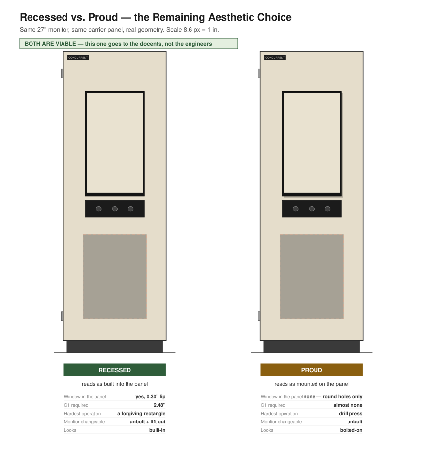

# Display Approach — Three Live Options

> ## ⛔ SUPERSEDED FOR REV 1
> The kiosk is no longer a replacement door integrated into the cabinet. It is a
> **self-contained enclosure surface-mounted on the closed factory door** — see
> [`rev1-standalone-kiosk.md`](rev1-standalone-kiosk.md) and the
> [interactive design study](rev1-design-study.html).
> This document describes the **Rev 2** concept and is kept for provenance.
> Don't build from it.

> **Decision status: OPEN.** This is now the top-level mechanical decision, above
> the enclosure question. All three options still need C1 (ME-1 §C), but they
> differ enormously in risk, cost and who can maintain the thing in five years.

**Reads with:** [`door-construction.md`](door-construction.md) ·
[`enclosure-buy-vs-build.md`](enclosure-buy-vs-build.md) ·
[`fab/`](fab/) · [`../docs/01-prd.md`](../docs/01-prd.md) §9

---

## At a glance



Drawn to the assumed cabinet geometry — proportions are real, unlike the AI
concept art elsewhere in the repo. Regenerate with
`python3 drawings/make-option-comparison.py`.

**The headline finding:** A, B and C1 look *almost the same from the front.* If
the monitor is recessed behind a bezel-sized cut, Option C reads as the approved
concept. Only C2 — monitor bolted proud of the panel — looks visibly different.

## The three

| | Approach | Display | Enclosure |
|---|---|---|---|
| **A** | Custom door | **De-cased** bare LCD panel | Fabricated: P1 face + P2 shroud |
| **B** | Buy + modify | **De-cased** bare LCD panel | Leviton structured-media can |
| **C** | **VESA carrier panel** | **Cased commercial monitor, intact** | The monitor's own housing |

C splits into **C1 (recessed)** and **C2 (proud)** — same architecture, very
different result on the one axis that matters to the docents.

A and B differ only in where the box comes from. **C is a different architecture.**

---

## Option C — cased monitor on a hinged carrier panel

Don't de-case anything. Leave the monitor whole, **VESA-mount it to a flat tan
carrier panel**, hinge that panel to the fixed frame, and put the three buttons
on a small plate below it.

```
fixed frame (reversibly mounted, unchanged)
   └── hinged carrier panel — flat tan sheet, left hinge
         ├── VESA 100 x 100 pattern  → commercial monitor, portrait
         ├── button plate below the screen
         └── Pi on the back
```

### What it eliminates

- **De-casing the monitor (EL-5)** — the highest-risk step in the electronics
  track, and irreversible
- **The screen window cut** — the single hardest fabrication operation
- **P2 shroud, P4 brackets** — the monitor's own housing satisfies MR18
- **Thermal design** — the monitor cools itself, as designed and tested by its
  manufacturer
- Panel retention, foam gasketing, window-to-active-area tolerance stack

If the monitor mounts on the **front** of the carrier panel, the panel needs only
an outline, four M4 VESA holes, button holes and hinge holes — **all round holes,
drillable by hand in an afternoon.** No laser, no job shop, no CDL.

### What it costs

**Aesthetics.** A modern black monitor bolted to a 1985 minicomputer reads as
"someone stuck a monitor on it." The docent-approved concept is about the kiosk
*belonging* to the machine — tan frame, black bezel, CONCURRENT badge (MR13).
This is the real loss.

*Mostly recoverable:* cut the carrier panel with a window sized to the monitor's
**bezel outline** and let the monitor sit behind it, so only the screen shows.
That restores the built-in look — and the tolerance is forgiving, because the
monitor's own bezel overlaps the cut. Nothing like the ±0.03″ a bare panel needs.
Add a tan surround and it reads close to the concept.

**Depth.** Roughly a wash. A thin 24″ monitor is ~0.4″ at the bezel and
~1.7–2.2″ at the electronics hump. Recessed into a window, only the hump sits
back — about the same as the 2.5″ custom door.

**MR19 (low profile).** Genuinely given up if the monitor sits proud rather than
recessed.

**Visitor-reachable OSD buttons.** A cased monitor has power and menu buttons.
Cover them with the surround or disable them (NFR3).

### What it wins that the others can't

**Serviceability, and it is not a small thing.** A commercial monitor dies in
2031 and a docent buys another one and bolts it on. A de-cased panel bonded into
a bespoke door cannot be replaced by anyone but us.

The project charter says: *"every project must hand operational ownership to its
actual user before it ships — Nick-in-the-loop forever means the project failed."*
Option C is the only one of the three that honours that for the display.

It also makes salvage-first **easier**, not harder — any working monitor with a
VESA pattern qualifies, and there's no de-casing risk to gamble a good panel on.

---

## Comparison

| | A — custom door | B — buy + modify | **C — VESA carrier** |
|---|---|---|---|
| De-casing risk | ⚠️ one-way | ⚠️ one-way | ✅ **none** |
| Hardest fab op | Window cut, lasered | Window cut, in a formed box | ✅ **round holes** |
| Parts to fabricate | 4 | 1 | ✅ **1, hand-drillable** |
| Thermal | Designed + soak-tested | Designed + soak-tested | ✅ **self-solved** |
| MR18 enclosure | Designed | Designed | ✅ **self-solved** |
| Cost | ~$150 fab + panel | ~$120 can + ~$60 face | ✅ **panel + monitor** |
| Lead time | ~1 week | Off the shelf | ✅ **same day** |
| Low profile (MR19) | ✅ 2.5″ | ⚠️ 3.85″ | ⚠️ ~2.2″ recessed, worse proud |
| Looks built-in (MR13) | ✅ **best** | ✅ good | ⚠️ needs a surround |
| **Replaceable by a docent** | ❌ | ❌ | ✅ **yes** |

---

## Open questions Option C has to answer

1. **Does the display still swing?** The hinge is the defining feature of the
   whole exhibit (MR5, and the entire premise of the brief — swing it open, see
   the card cage). VESA-mounting to a *hinged carrier panel* preserves it. VESA
   mounting straight to the cabinet does **not**, and would gut the concept.
   **The carrier panel is not optional.**
2. **Where do the buttons live?** On the swinging panel (they travel with it), or
   fixed to the frame (they stay put while the screen opens)? Fixed is arguably
   better for visitors and changes what crosses the hinge.
3. **Where does the Pi live?** Behind the monitor on the carrier panel, or in the
   fixed cabinet? If it moves off the door, HDMI + USB cross the hinge instead of
   just 5 V — that reverses A7.2, and needs a service loop rated for it.
4. **Portrait rotation** — monitor rotated 90° on the VESA plate. Confirm the
   candidate's bezel and stand mount allow it cleanly.

---

## Recommendation

**Option C, with the monitor recessed into a bezel-sized window and a tan
surround.**

It removes the two highest-risk items in the project (de-casing and the window
cut), collapses fabrication to one hand-drillable panel, self-solves thermal and
enclosure, and is the only option a museum can maintain without us. Those are
decisive engineering advantages, and the aesthetic gap is mostly closable.

**But this is not purely an engineering call.** The concept Rick signed off on
("YES YES YES. This is just the job.") shows an integrated tan door, not a
commercial monitor in a frame. Changing that should go back to the docents before
it's locked — a mock-up photo would settle it in one conversation.

**Still gated on C1 either way.** Take Wednesday's measurement; then decide.
Nothing here obsoletes the [fab package](fab/) — if A or B wins, it's ready.
