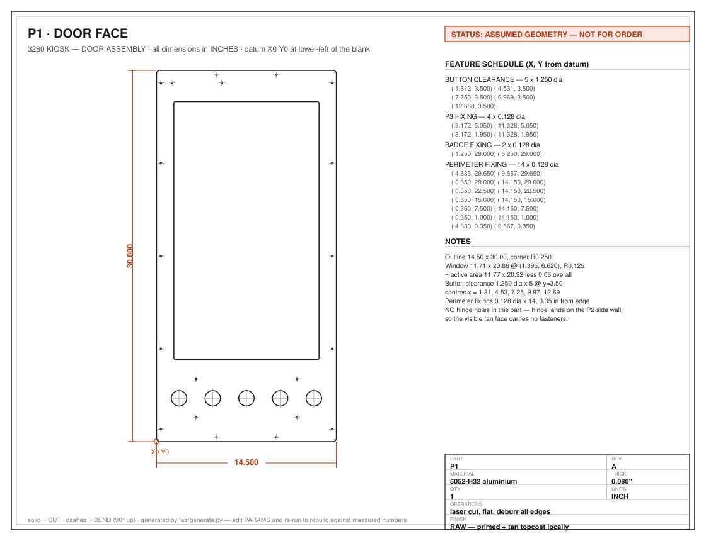
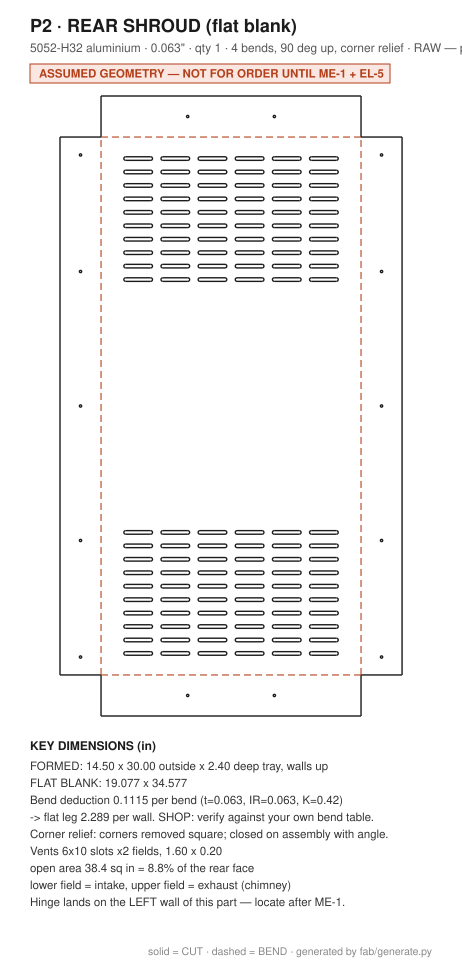
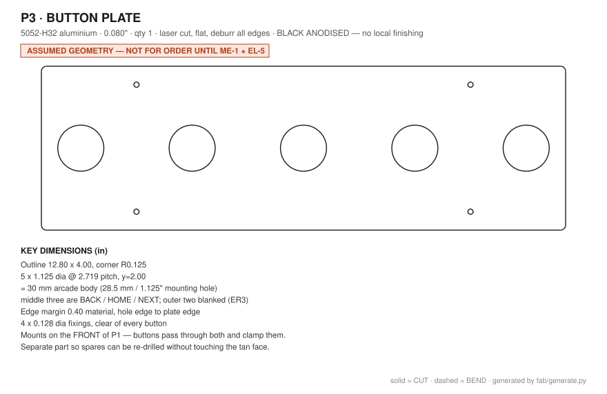
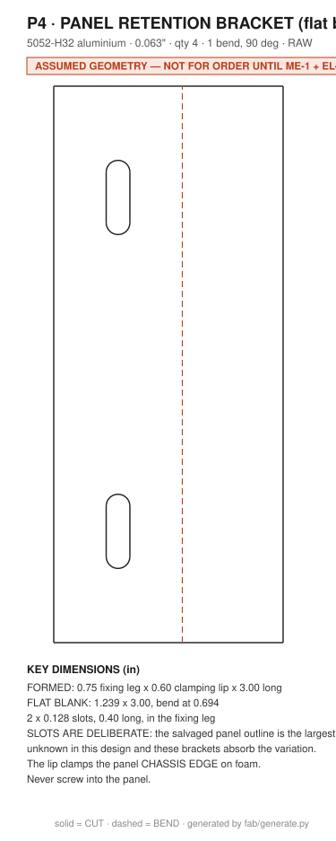
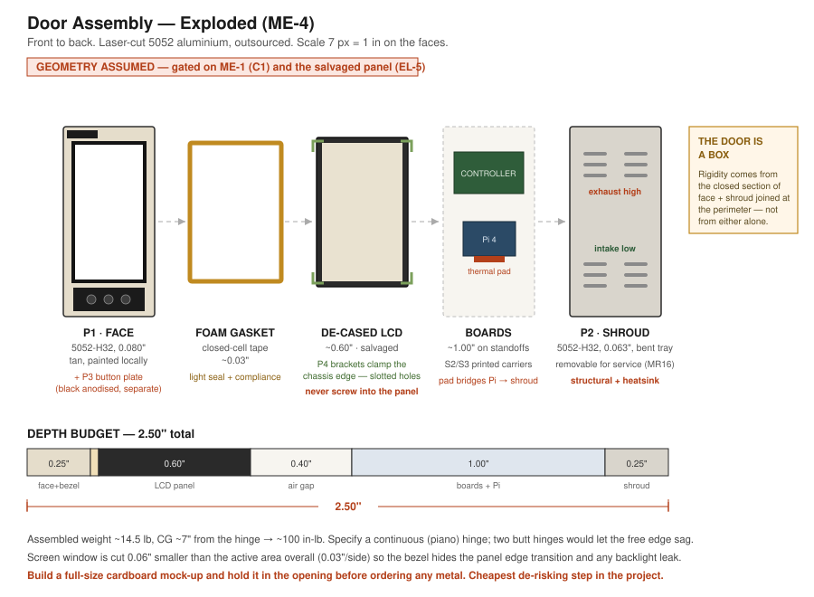

# Drawing Package — Kiosk Door Assembly

### An ask for the makers at CDL

> **What this is:** a four-part sheet-metal assembly for an interactive exhibit
> being built into the Vintage Computer Federation's **Concurrent 3280**. We have
> the design; we're looking for help with the fabrication.
>
> **Status: drawn against assumed dimensions.** The cabinet hasn't been measured
> yet and the display panel hasn't been salvaged. Numbers will move. We're
> sharing now to find out what's *makeable* before we commit to geometry.

---

## 1. The project in one paragraph

A portrait display mounted on a hinge over the 3280's card cage. Visitors drive
it with **three physical buttons — BACK / HOME / NEXT. No touchscreen.** Swing
the door open and the real boards are behind it. The door has to look like it
belongs on a 1980s minicomputer, survive unattended public use, and mount to the
cabinet **reversibly — no drilling into the artifact.**

Full project: [github.com/nickdnj/3280-kiosk](https://github.com/nickdnj/3280-kiosk)

---

## 2. What we're asking

**Can CDL fabricate some or all of these four parts?** Or, if not — tell us what
*would* be makeable with the tools on hand, and we'll redesign toward it.

We're not attached to the current approach. It's specified as outsourced laser
cutting because that was the lowest-risk path for one person working alone. If
there are people and machines here that could do it better, we'd much rather
build it locally — and the exhibit is for this museum's own collection.

Specific questions in §7.

---

## 3. The parts

| Part | Description | Material | Thick | Qty | Operations | Finish |
|---|---|---|---|---|---|---|
| **P1** | Door face | 5052-H32 alu | 0.080″ | 1 | Cut flat: outline, screen window, 5 button holes, fixing holes | Raw → primed + tan |
| **P2** | Rear shroud | 5052-H32 alu | 0.063″ | 1 | Cut flat + **4 bends** 90° → shallow tray | Raw → primed + tan |
| **P3** | Button plate | 5052-H32 alu | 0.080″ | 1 | Cut flat: 5 × 1.125″ holes | Black anodized |
| **P4** | Panel bracket | 5052-H32 alu | 0.063″ | 4 | Cut flat + **1 bend** 90° | Raw |

**Blank sizes:** P1 14.50 × 30.00 · P2 **19.08 × 34.58** · P3 12.80 × 4.00 ·
P4 1.24 × 3.00

Total material: roughly **one 24 × 48 sheet of 0.063″ and a half-sheet of
0.080″**, with nesting.

---

## 4. Drawing sheets

Each sheet carries a datum, overall dimensions, a full feature schedule with X/Y
coordinates for every hole, and notes. Dimensions in inches.

### P1 — Door face

### P2 — Rear shroud (flat blank, 4 bends)

### P3 — Button plate

### P4 — Panel retention bracket (×4)

**DXFs:** [P1](P1-face.dxf) · [P2](P2-shroud-flat.dxf) ·
[P3](P3-button-plate.dxf) · [P4](P4-panel-bracket.dxf)
R12 ASCII, inches, `CUT` and `BEND` layers, closed contours.

---

## 5. How it goes together

Front to back: **P1 face** (tan, with the screen window and a painted satin-black
bezel field) → foam gasket → **de-cased LCD panel**, clamped at its chassis edges
by the four **P4** brackets → controller board and a Raspberry Pi on standoffs →
**P2 vented shroud**, screwed on, removable for service. **P3** mounts on the
*front* of P1; the buttons pass through both plates and clamp them together.

Three things drove the design:

- **The door is a box.** Rigidity comes from the closed section of P1 + P2 joined
  at the perimeter. P2 is structural, not a cover.
- **Thermal.** A Pi and an LCD backlight in a sealed 2.5″ box gets hot. A thermal
  pad from the Pi to the aluminum shroud makes the whole shroud a heatsink; the
  vent field is intake-low / exhaust-high. That's the main reason for metal over
  wood or plastic.
- **No fasteners on the visible face.** P1 has no hinge holes — the hinge lands
  on P2's left wall.

Context drawings: [swing & clearance](../drawings/03-plan-section-clearance.svg) ·
[front elevation](../drawings/01-cabinet-front-elevation.svg) ·
[build spec](../door-construction.md)

---

## 6. Finishing

**Please don't powder coat P1, P2 or P4.** The tan is being color-matched to the
3280's own finish and no standard powder palette will hit it — those get
self-etching primer and a matched topcoat by hand. P3 is the one part we'd want
finished (black anodized) because it can't be matched by spraying.

**Deburr everything.** This is a public exhibit that children will put hands on.

---

## 7. Questions for you

Answers to any of these help — no need to work through all of them.

**Capability**
1. Can you cut 0.063″ and 0.080″ aluminum sheet? What machine — laser, plasma, waterjet, CNC router, shear + nibbler?
2. Do you have a **brake** that can bend a 34″ leg? That's the constraint on P2.
3. Black anodizing — in house, or should P3 go out?
4. Do you have a 3D printer we could use for the small parts (panel clips, Pi carrier, over-travel stop)?

**Material**
5. Is 5052 sheet something you stock or scrap-pile? We're salvage-first on this whole project and would rather use what's on hand than buy.
6. Would a different alloy or gauge be easier to get? We can redesign around it.

**Approach**
7. If a 4-bend tray is awkward, we have a **flat-pack alternative**: P2 becomes a flat back panel with the 2.4″ depth made by perimeter angle stock. Zero bends, more assembly. Easier or harder for you?
8. Anything about this you'd do differently? Genuinely asking — the design is a week old and nobody's checked it but us.

**Logistics**
9. What lead time is realistic, and what would you want from us — files, material, beer, labor?

---

## 8. Important caveat — don't cut anything yet

Everything here derives from **assumed** dimensions: the cabinet is un-measured
and the panel un-salvaged. Before any metal is cut we still need to:

- Measure the cabinet, especially the **closing clearance** behind the front face
  (that number sets the door depth and could force a redesign)
- Salvage, power-test and de-case a ~24″ LCD, then measure its real outline
- Have the buttons in hand to confirm the hole diameter
- Hold a **full-size cardboard mock-up** in the opening

The whole package is generated from a script with one parameter block
([`generate.py`](generate.py)) — when the real numbers land, every drawing and
DXF rebuilds in one command. So a change in the panel size isn't a redraw, it's
an edit and a re-run.

**What we'd love right now is a reality check on makeability**, not a cut.

---

## 9. Contact

Nick DeMarco · [github.com/nickdnj/3280-kiosk](https://github.com/nickdnj/3280-kiosk)
· issue [ME-4](https://github.com/nickdnj/3280-kiosk/issues/29) tracks this work

*This is a concept build — the guiding light we're driving toward, not a shipped
exhibit. Cabinet imagery elsewhere in the repo is AI concept art and is flagged
as such.*
