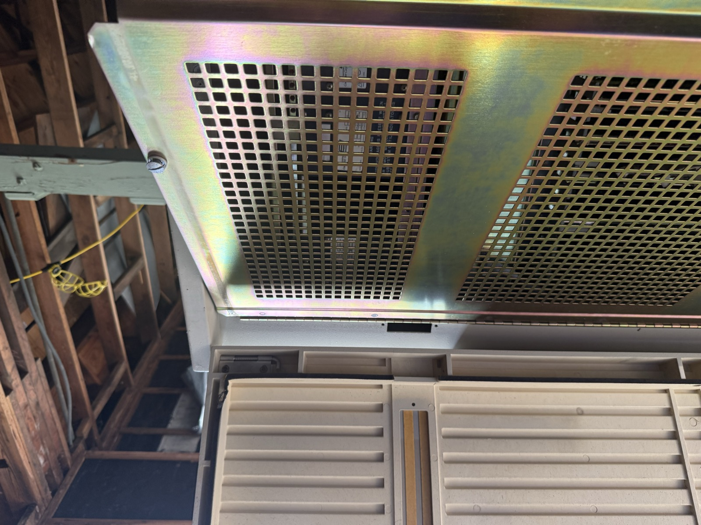
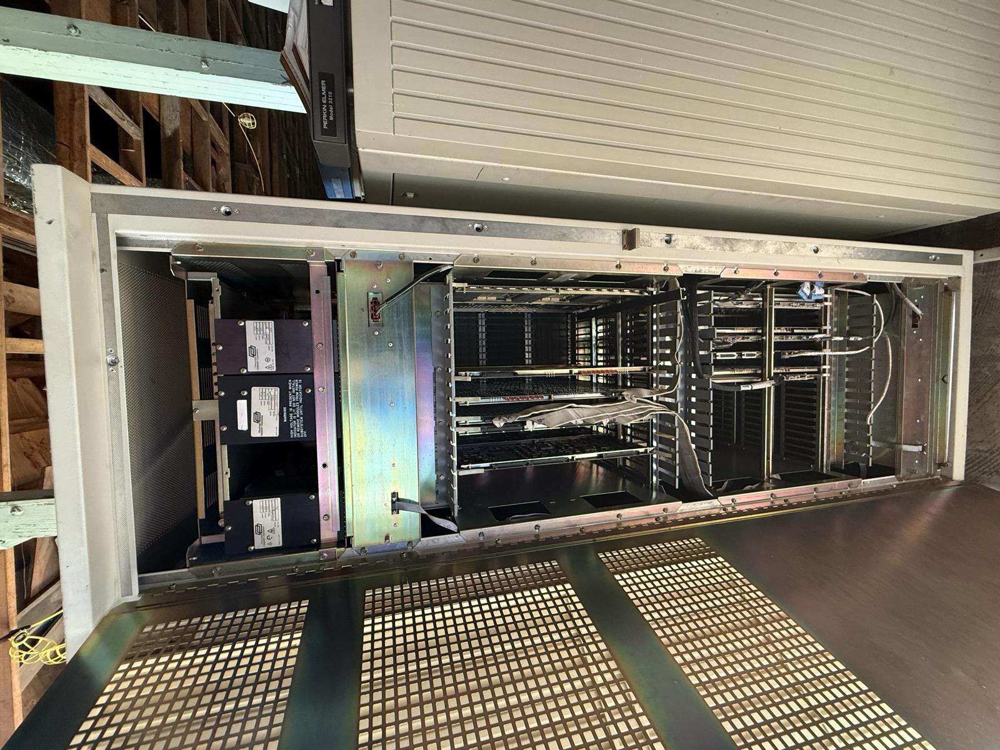

# ME-1 — First Site Visit, 2026-08-26

**Read off photographs, not from a filled field sheet.** Everything here is my
reading of the tape in your pictures. Treat it as *provisional* — good enough to
redesign against, not good enough to cut metal against. Values marked ⚠️ need you
to confirm from memory or a second visit.

**Photos:** [`photos/`](photos/) · **Supersedes assumptions in:**
[`dimensions-assumed.md`](dimensions-assumed.md)

---

## 1. The headline: the machine is not what we assumed

**The 3280 has two doors. There is no open card cage.**

| Layer | What it is |
|---|---|
| **Outer door** | Tan **louvered** door, hinged (left in the photos), with a dark vertical trim strip carrying a "SYSTEM #1" label and an X in marker |
| **Inner door** | **Perforated zinc-plated steel** panel, separately hinged on a piano hinge, three rectangular perforated fields |
| **Behind** | The card cage — boards, ribbon cables, Concurrent-branded power supply modules down one side |

Every drawing in this repo shows a cabinet with an **open front opening** and a
visible card cage, with our kiosk door mounted into a fixed frame spanning it.
That geometry does not exist. The concept render invented it.

### What this changes

**It probably makes the project easier, not harder.**

- **Mount candidate C just became the obvious answer.** There is already a
  hinged tan door of roughly the right size in the right place. The cleanest
  design is now: **remove the outer louvered door, hang our panel on its hinges,
  and keep the original door safely stored.** That is perfectly reversible —
  arguably *more* reversible than clamping to rails, because nothing is touched
  but a door that was designed to come off.
- **ME-2, ME-3 and the whole "fixed frame" epic may collapse.** No frame is
  needed if we reuse the door aperture.
- **ME-10 / the plexiglass deferral is moot.** The boards are already behind a
  perforated steel door. Exposed-board risk (PRD §11) largely goes away.
- **MR14 ventilation is interesting** — the outer door is *louvered* because the
  machine needs airflow. A solid kiosk panel in its place blocks that. Irrelevant
  for a non-running machine, but worth a note if VCF ever powers it.

### What this breaks

**"Viewing area around the display" (MR3) no longer means anything.** There is no
open card cage to see around the screen — there's a perforated steel door. The
concept's framed-screen-with-machine-visible-around-it look needs rethinking.

Options, roughly: leave the inner perforated door as the visible surround and
light it from behind; make our panel smaller than the aperture and leave the
perforated door showing around it; or cut a viewing window in our panel with the
inner door opened and the cage lit. **This is a design decision, and it should go
back to the docents** — it changes what Rick approved.

---

## 2. Measurements I can read

| Ref | What | Assumed | **Read from photo** | Confidence |
|---|---|---|---|---|
| A2 | Cabinet overall height | 69.5″ | **≈ 67-7/8″** | Good — clear tape read |
| A6 | Front opening clear width | 19.0″ | **≈ 18.5–19″** | Good — clear tape read |
| A1 | Cabinet / outer door width | 23.0″ | **≈ 23–24″** ⚠️ | Poor — but **OEM spec says 24″**, see below |
| ? | A vertical run | — | **≈ 48″** ⚠️ | Read is clear; **what it spans is not** |
| ? | A second vertical run | — | **≈ 32″** ⚠️ | Read is clear; **what it spans is not** |

> **Manufacturer data now available.** Concurrent's own 1989 product overview
> gives the 3280MPS cabinet as **71″ H × 24″ W × 34″ D** — see
> [`cabinet-spec-oem.md`](cabinet-spec-oem.md). Width and depth are settled.
> The height does **not** reconcile with the photo read (71″ vs ~67-7/8″) and
> needs re-measuring.

**The two assumptions that mattered most held up.** 19″ opening width and a
~68″ cabinet are close enough to what we drew that the door geometry
(14.5 × 30) still works — subject to §3.

### ⚠️ Please confirm

1. **[`me1-vertical-48.jpg`](photos/me1-vertical-48.jpg)** — the tape reads ~48″.
   Where was the hook, and what was the top? Full door aperture height?
2. **[`me1-vertical-32.jpg`](photos/me1-vertical-32.jpg)** — reads ~32″. Card
   cage height? Inner perforated door?
3. **[`me1-door-width-tape.jpg`](photos/me1-door-width-tape.jpg)** — is that the
   outer louvered door width, or the whole cabinet?

Three numbers, and the mechanical design keys off all of them.

---

## 3. What is still missing — including the one that matters most

| Ref | Missing | Why it matters |
|---|---|---|
| **C1** | **Closing clearance** — door plane to the frontmost thing inside | **The gate on everything.** Not measurable from any photo here |
| A3 | Cabinet overall depth | Sanity check |
| A5/A8 | Floor → bottom of the door aperture (AFF) | ADA button height (A1) |
| B1–B8 | Rack rails — present? free run? hole type? | The photos *suggest* rails beside the card cage; unconfirmed |
| D1–D6 | Left-side swing clearance, hinge details | Door travel |
| F1 | A tan scrap for paint matching | MR13 |

**C1 also changes meaning now.** The question is no longer "how deep is the
opening" but **"how much depth is there between the outer door plane and the
inner perforated door?"** That's the volume our display has to live in. Measure
it with the outer door removed and the inner door closed.

---

## 4. What I'd do next

1. **Confirm the three ⚠️ numbers above.** Cheapest possible win.
2. **Measure the outer louvered door** — height, width, thickness, hinge type and
   spacing, latch. If we're reusing its aperture, that door *is* the spec.
3. **Measure C1 as redefined** — outer door plane to inner perforated door.
4. **Photograph the hinges** close up, both doors, and the latch hardware.
5. Then I rewrite `dimensions-assumed.md` as `dimensions.md` with real numbers,
   re-run `fab/generate.py`, and redraw the option comparison against the real
   two-door architecture.

**Hold the fab package.** Not because the numbers moved much — they barely did —
but because the thing it mounts to turned out not to exist.

---

## 5. Incidental finds

- A **Perkin-Elmer Model 3210** sits alongside in
  [`me1-inner-door-open-cardcage.jpg`](photos/me1-inner-door-open-cardcage.jpg).
  Perkin-Elmer is Concurrent's ancestor — worth a note for the wiki and possibly
  for exhibit copy.
- **Multiple identical cabinets** in the warehouse
  ([`me1-cabinets-in-warehouse.jpg`](photos/me1-cabinets-in-warehouse.jpg)). If
  more than one is available, a **spare outer door** solves reversibility
  completely — modify a spare and the original never gets touched. Worth asking
  VCF about.
