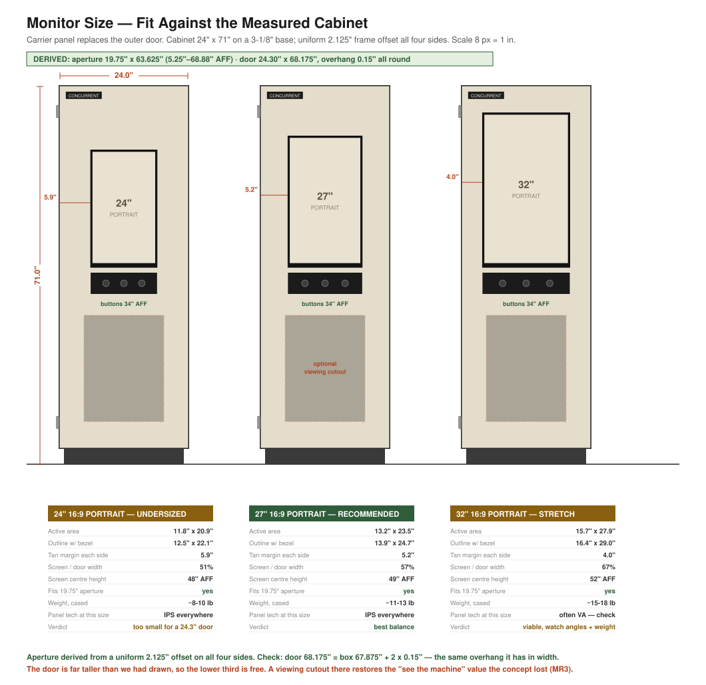

# Monitor Selection — Validated Against the Measured Cabinet

**Recommendation: 27″ 16:9 IPS, 2560×1440, matte, run portrait.**
24″ is now undersized. 32″ is viable but carries real risks.

**Reads with:** [`cabinet-spec-oem.md`](cabinet-spec-oem.md) ·
[`me1-findings.md`](me1-findings.md) ·
[`display-approach-options.md`](display-approach-options.md)

---

## 1. The correction that drives this

Every drawing before this one assumed a **14.5″-wide kiosk door set inside a 19″
opening**, with a fixed frame spanning an open card cage.

That's not the machine. The 3280 has a **louvered outer door roughly 24.3″ wide**
covering the whole cabinet face, and the cleanest design is to **replace that door
with our carrier panel**. So the usable face is not 14.5″ — it's **24.3″**.

**A 24″ monitor was the right answer to the wrong question.** In portrait it is
only 12.5″ wide. On a 24.3″ door that's 51% of the width, with 5.9″ of blank tan
either side. It reads as a small screen bolted to a big panel, not as a kiosk.

---

## 2. Fit table

Cabinet: **24″ W × 71″ H overall**, 3-1/8″ base, ~19.75″ clear opening,
34″ deep. Carrier panel ≈ 24.3″ wide.

| | **24″** | **27″** ✅ | **32″** |
|---|---|---|---|
| Active area, portrait | 11.8 × 20.9 | **13.2 × 23.5** | 15.7 × 27.9 |
| Outline with bezel | 12.5 × 22.1 | **13.9 × 24.7** | 16.4 × 29.0 |
| Tan margin each side | 5.9″ | **5.2″** | 4.0″ |
| Screen / door width | 51% | **57%** | 67% |
| Fits the 19.75″ opening | yes | **yes** | yes, 1.7″/side |
| Weight, cased | ~8–10 lb | **~11–13 lb** | ~15–18 lb |
| Panel tech at this size | IPS everywhere | **IPS everywhere** | often VA |
| Verdict | undersized | **best balance** | viable, watch angles + weight |

All three fit. **Nothing here is a hard geometric constraint** — the decision is
proportion, viewing angle and weight.

---

## 3. Why 27″

**Proportion.** 57% of the door width reads as a display *set into* a tan frame,
which is the concept. 51% reads as undersized; 67% leaves only 4″ of tan and
starts to look like a monitor wearing a cabinet.

**Viewing angle — the argument people forget.** Visitors approach an exhibit from
the side, not head-on. **IPS is close to mandatory**, and at 27″ every panel worth
buying is IPS. At 32″ a large share of the market is VA, which washes out and
shifts colour off-axis. A cheap 32″ VA panel viewed at 45° looks bad in exactly
the situation this exhibit lives in.

**Weight.** ~12 lb against ~17 lb matters on a door hung from original hinges we
are not allowed to modify.

**Resolution — pick 1440p.** At 27″: 1080p is 81 PPI (fine at 3–6 ft, soft up
close), **1440p is 109 PPI** (crisp, and text-heavy portrait content is what this
exhibit is), 4K is 163 PPI and overkill. It also matters at the Pi: a Raspberry Pi
4 rotates 1440p comfortably; **compositor rotation at 4K is sluggish** and would
hurt the interaction feel.

**Availability.** 27″ IPS is one of the highest-volume panels made — easy to
salvage, cheap to buy, and trivially replaceable by a docent in 2031. That last
point is the whole argument for the cased-monitor approach
([`display-approach-options.md`](display-approach-options.md) Option C).

---

## 4. Two selection criteria that are easy to miss

### ⚠️ It must power on by itself when mains returns

The exhibit runs on an **AC timer** (EL-4, architecture A7.1) — power is cut at
close and restored at open. Many monitors come back in **standby** after a power
cut and need a button press. That would mean a black screen every morning until
a docent notices.

**Test this before committing to any monitor:** plug it into a switched strip,
kill the power, restore it, and confirm the panel comes back on its own with no
input. If a candidate fails, either find one with a "last state"/"auto power on"
OSD setting, or the AC-timer plan needs rethinking.

This is a **go/no-go** criterion, not a nice-to-have.

### Matte, not glossy

A museum floor has overhead lights and often daylight. Glossy panels mirror them.
**Anti-glare/matte only.**

---

## 5. What to shop for

> **27″ · 16:9 · IPS · 2560×1440 · matte · HDMI or DisplayPort · VESA 100×100 ·
> comes back on after a power cut**

Also want: thin bezel, no aggressive branding on the chin, and OSD buttons that
can be hidden behind the carrier panel or disabled.

Don't care about: refresh rate above 60 Hz, speakers, USB hub, HDR, curve
(**avoid curved** — it fights a flat panel and looks wrong in portrait).

Salvage-first still applies. A 27″ IPS is common enough that the warehouse or the
second-hand market is a real option — but the **power-cut test above is
mandatory** whatever the source.

---

## 6. Still gated

The one dimension this analysis rests on that is **not yet confirmed** is the
**door aperture height** (assumed 48″, at 7″ AFF). It doesn't change the *width*
maths at all — width is what decides the monitor size — but it sets whether the
27″ block (24.7″ screen + 1″ + 4″ buttons ≈ 30″) sits comfortably with margin.
At 48″ it has 18″ to spare, so the recommendation is robust unless the real
aperture is under ~34″.

**C1 still unmeasured**, and it decides recessed vs. proud mounting — not
monitor size.

---

*Recorded 2026-08-27. Supersedes the 24″ target in
[`dimensions-assumed.md`](dimensions-assumed.md) §D and
[`../electronics/salvage-recon.md`](../electronics/salvage-recon.md) §1.*
